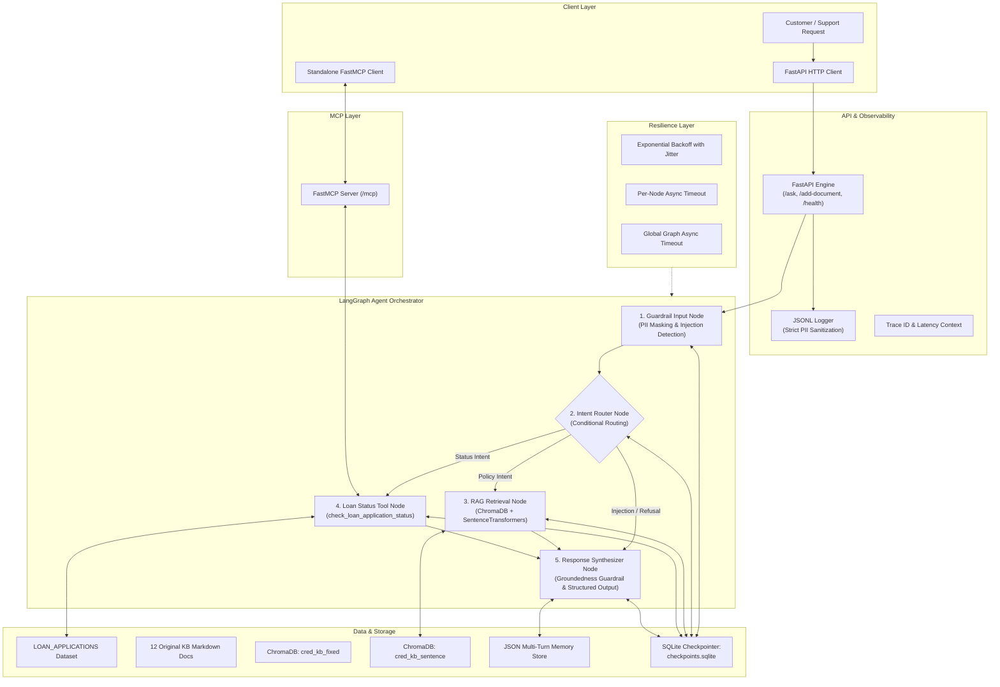

# Architecture: Cred Domain Support Agent (Banking & FinTech Track)

## 1. System Overview

The **Cred Domain Support Agent** is a production-hardened AI assistant designed for Cred's lending operations. It handles two primary customer intents:
1. **Lending Policy Inquiries**: Addressed via a Dual-Collection RAG pipeline that retrieves authoritative policy clauses and generates grounded answers.
2. **Loan Application Status Inquiries**: Addressed via deterministic record retrieval and a mathematical multi-factor **Escalation Score** computation.

The entire system is orchestrated with **LangGraph**, secured with **Input/Output Guardrails**, monitored via **Structured JSON-Lines Logging**, and hardened using **SQLite Checkpointing**, **Exponential-Backoff Retries**, and **Per-Node / Global Timeouts**. It also exposes tools across process boundaries using **FastMCP (Model Context Protocol)** and provides standard HTTP access through **FastAPI**.

Critically, the entire stack runs deterministically under `MOCK_LLM` with **zero API keys and zero network dependencies**.

---

## 2. Component Architecture Diagram

---

## 3. Detailed Subsystem Specifications

### 3.1 Dataset Design (`dataset/dataset.py`)
- **Seeded Generator**: Seed `42`.
- **Invariants**:
  - Size $\ge 40$ records (generates 45 records).
  - 5 Categories: `Personal Loan`, `Home Loan`, `Auto Loan`, `Education Loan`, `Business Loan` (each $\ge 3$ records).
  - 5 Statuses: `Submitted`, `Under Review`, `Approved`, `Rejected`, `Disbursed` (each $\ge 1$ record).
  - `days_since_created`: Integer $\in [0, 30]$.
  - `loan_amount_inr`: Realistic Indian retail lending amounts (₹50,000 to ₹5,000,000).
  - `flagged_for_fraud_review`: Percentage rigorously constrained to $10\% \le \text{rate} \le 30\%$.

### 3.2 Dual RAG Pipeline (`rag/`)
- **Knowledge Base**: 12 authoritative banking documents covering:
  1. Loan eligibility criteria by loan type
  2. EMI calculation rules
  3. Credit-card fee structure
  4. KYC document requirements
  5. Fraud-dispute resolution process
  6. Account-closure process
  7. Interest-rate slabs
  8. Prepayment-penalty rules
  9. Minimum-balance requirements
  10. Credit-score impact factors
  11. Joint-account rules
  12. NRI-account eligibility
- **Chunking Strategies**:
  - Strategy A: Fixed-size chunks (150 chars) with 30-char overlap.
  - Strategy B: Sentence-based chunks boundary-split on punctuations.
- **Embeddings & Vectorstore**:
  - Model: `sentence-transformers/all-MiniLM-L6-v2`.
  - ChromaDB collections: `cred_kb_fixed` and `cred_kb_sentence`.
- **Empirical Threshold Calibration**:
  - Top-1 cosine similarity measured across in-scope and out-of-scope test suites.
  - Fallback threshold dynamically or empirically selected at separation margin.
- **Evaluation**:
  - Document-level Precision@3 and Recall@3 with parent document deduplication.
  - Strategy recommendation based on empirical performance.

### 3.3 Loan Status Tool & Escalation Math (`agent/tools.py`)
- **Tool Signature**: `check_loan_application_status(record_id: str) -> dict`.
- **Escalation Score Formula**:
`recency_signal = days_since_created / 30.0`

`escalation_score = 0.60 × fraud_flag + 0.40 × recency_signal`

Where:
- `fraud_flag` = 1 if the application is flagged for fraud review, otherwise 0.
- `recency_signal` = `days_since_created / 30.0`.
- `escalation_score` is a continuous value between `0.0` and `1.0`.
- Escalation threshold: `τ = 0.65`.

### 3.4 LangGraph State & Node Architecture (`agent/graph.py`)
- State schema holds: `session_id`, `trace_id`, `raw_input`, `sanitized_input`, `intent`, `retrieved_chunks`, `loan_record`, `escalation_score`, `final_response`, `guardrail_flags`, `grounded`.
- **Nodes**:
  1. `guardrail_input_node`: Masks PAN, Aadhaar, Bank Account numbers; scans for prompt injections.
  2. `intent_router_node`: Discriminates `policy_rag`, `loan_status`, or `refusal`.
  3. `rag_retrieval_node`: Vector search + grounded generation.
  4. `loan_tool_node`: Executes lookup and escalation calculation.
  5. `response_synthesizer_node`: Formulates strict Pydantic response and validates groundedness.

### 3.5 Guardrails (`agent/guardrails.py`)
- **PII Masking**: Fixed regex masks for:
  - Permanent Account Number (PAN): `[A-Z]{5}[0-9]{4}[A-Z]` $\to$ `[MASKED_PAN]`
  - Aadhaar: `\b\d{4}\s?\d{4}\s?\d{4}\b` $\to$ `[MASKED_AADHAAR]`
  - Bank Account: `\b\d{9,18}\b` $\to$ `[MASKED_ACCOUNT]`
- **Prompt Injection**: Scans for system override tokens (`ignore previous instructions`, `DAN mode`, `system override`, delimiter hijacking).
- **Output Groundedness**: Refuses to answer if claim facts are not substantiated by retrieved context.

### 3.6 Persistence & Memory (`agent/memory.py`)
- JSON file store (`memory_store.json`).
- Tracks recent entities (e.g. `last_mentioned_loan_id`, recent topics) to support multi-turn coreference resolution (e.g., "What about that loan?").

### 3.7 FastAPI & JSONL Observability (`api/`)
- Endpoints:
  - `POST /ask`: Full pipeline invocation returning structured JSON response.
  - `POST /add-document`: Ingests new policy documentation dynamically into both ChromaDB collections.
  - `GET /health`: System diagnostics and collection counts.
- `logs/agent_requests.jsonl`: Sanitized structured logs with timestamp, trace ID, endpoint, latency, and masked input/output.

### 3.8 FastMCP Server & Standalone Client (`mcp/`)
- Server exposes `check_loan_application_status` tool mounted at `/mcp`.
- Separate client script invokes tool over HTTP for multiple records and verifies standard JSON-RPC / MCP responses.

### 3.9 Resilience & Checkpointing (`resilience/`)
- **SQLite Checkpointing**: Integrates `langgraph-checkpoint-sqlite` (`checkpoints.sqlite`). Demonstrates interrupt and resume on the same `thread_id` without re-running earlier nodes.
- **Exponential Backoff**: Decorator with `max_attempts=3`, initial interval, max interval, and random jitter. Recovers transient failures.
- **Timeouts**: Async timeouts for per-node execution and global graph deadline.

